# 🤖 Dual Tracking 3D Printing Robot
# 移动机器人3D打印层间偏差优化系统

[English](#english) | [中文](#中文)

---

## 🌟 Key Features / 项目亮点

- 🎯 **双寻迹策略**：创新的层间偏差优化算法（RMSE降低73.6%-88.0%）
- 🤖 **移动机器人+机械臂协同**：ROS框架下的多机协作
- 📷 **视觉引导**：实时线检测与喷头定位
- 🎛️ **自适应控制**：基于曲率的变速打印控制

---

## 中文

### 📖 项目简介

基于ROS的移动机器人3D打印系统，实现了层间偏差优化的双寻迹策略。系统集成了移动底盘（Limo）、六轴机械臂（MyCobot 320）和视觉系统，通过实时线检测和自适应控制算法，显著提升了3D打印的精度和成功率。

**研究成果**：发表于《中国机械工程》期刊（2025年）

**技术栈**：ROS Noetic | Python 3.8 | C++17 | OpenCV 4.x

### 🏗️ 系统架构

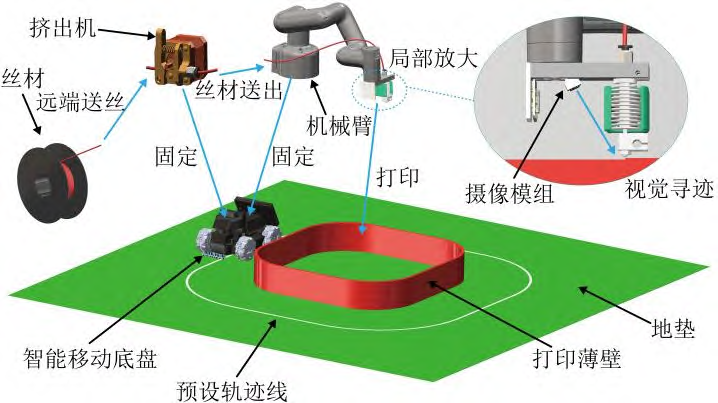

**核心组件**：

| 组件 | 型号 | 功能 |
|------|------|------|
| 移动底盘 | AgileX Limo | 平台移动与定位 |
| 机械臂 | MyCobot 320 | 3D打印操作 |
| 视觉系统 | USB摄像头 | 实时线检测 |
| 动作捕捉 | Vicon系统 | 高精度测量（0.1mm） |

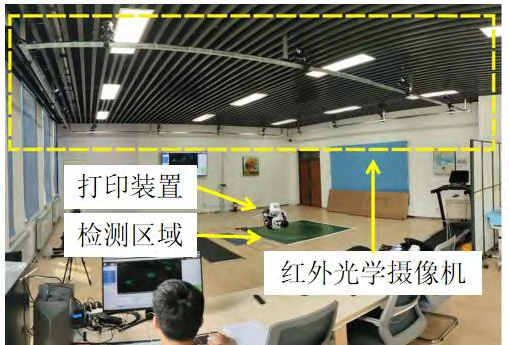

### 🔬 算法原理

#### 双寻迹策略

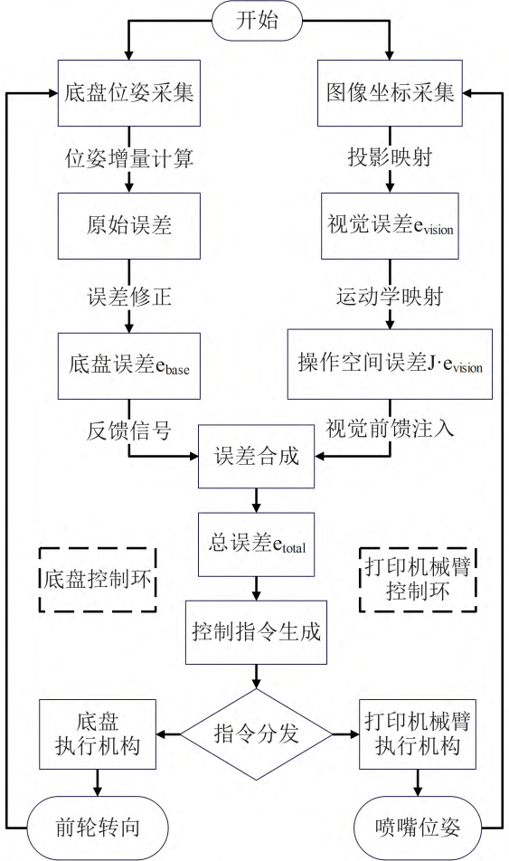

**核心思想**：

1. **第一层寻迹（底盘寻迹）**：移动底盘沿预定路径移动
   - SLAM导航定位
   - 累积误差导致偏差（5.3mm-13.0mm RMSE）

2. **第二层寻迹（机械臂寻迹）**：基于视觉反馈实时补偿
   - HSV颜色空间转换
   - 形态学处理去噪
   - 轮廓检测与中心线提取
   - PID控制器调整

3. **双寻迹协同**：底盘+机械臂闭环控制
   - 挤出丝层间偏差降至1.4mm-2.3mm RMSE
   - 提升幅度73.6%-88.0%

#### 坐标系定义

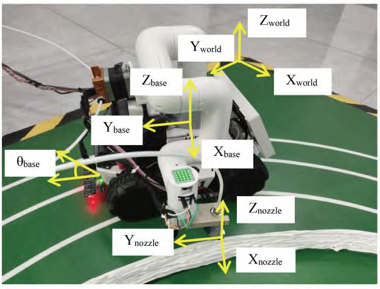

#### 喷嘴偏移补偿

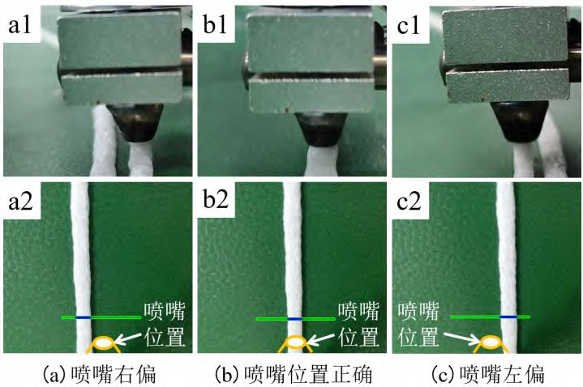

#### 关键算法

**线检测算法**：
```
图像 → HSV转换 → 形态学处理 → 轮廓检测 → 中心线提取 → 偏差计算
```

**偏差补偿**：
```
视觉偏差 → PID计算 → 机械臂位姿调整 → 实时补偿
```

### 📊 实验结果

#### 实验设置

| 参数 | 值 | 说明 |
|------|-----|------|
| 底盘线速度 | 8mm/s | 优化后的工艺参数 |
| 打印温度 | 250°C | 材料适用温度 |
| 挤出速度 | 10mm/s | 与底盘速度匹配 |
| 喷嘴直径 | 3mm | 大尺寸打印 |
| 打印尺寸 | 1200mm × 1200mm | 薄壁件验证 |
| 打印层数 | 35层 | 高度60mm |
| 测试标准 | ISO 52902 / ISO 10360-7 | 国际标准 |

#### 底盘轨迹精度

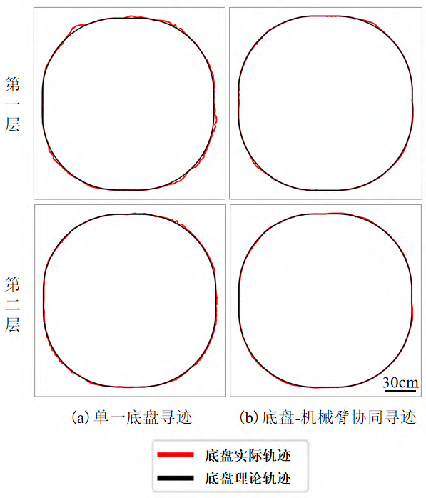

#### 机械臂末端轨迹层间偏差

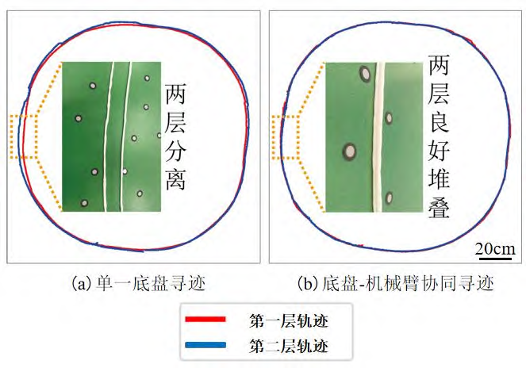

**机械臂末端轨迹层间偏差对比**：

| 指标 | 单一底盘寻迹 | 双寻迹策略 | 提升幅度 |
|------|-------------|-----------|---------|
| **RMSE** | 5.9mm - 11.1mm | 3.4mm - 5.0mm | 22.0% - 55.0% |
| **平均偏差** | 5.3mm - 9.4mm | 2.8mm - 3.9mm | 26.3% - 58.0% |
| **标准差** | 2.5mm - 5.9mm | 2.0mm - 3.0mm | 4.5% - 49.1% |

#### 挤出丝层间偏差（核心指标）

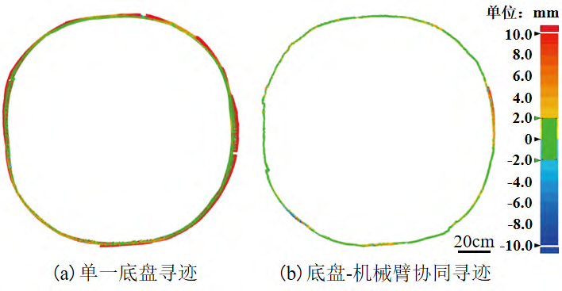

**挤出丝层间偏差对比**：

| 指标 | 单一底盘寻迹 | 双寻迹策略 | 提升幅度 |
|------|-------------|-----------|---------|
| **RMSE** | 5.3mm - 13.0mm | 1.4mm - 2.3mm | **73.6% - 88.0%** |
| **最大偏差** | 32.8mm - 64.1mm | 4.9mm - 12.7mm | 67.9% - 86.4% |
| **标准差** | 5.6mm - 13.2mm | 1.6mm - 2.5mm | 71.4% - 83.8% |

#### 35层1200mm×1200mm薄壁打印验证

| 半开环打印 | 双闭环打印 |
|:---:|:---:|
| 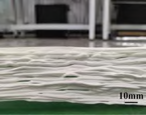 | 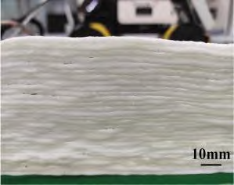 |

#### 不同形状移植性验证

| 凸型薄壁（1200mm × 598mm） | 凹型薄壁（2500mm × 1000mm） |
|:---:|:---:|
| 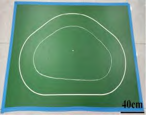 | 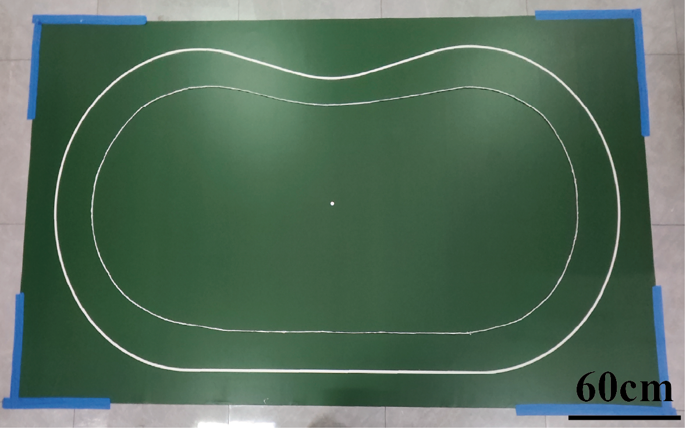 |

#### 实验结论

- **显著提升精度**：挤出丝层间偏差RMSE降低73.6%-88.0%
- **有效补偿偏差**：最大偏差从32.8-64.1mm降至4.9-12.7mm
- **验证可移植性**：成功应用于"凸"型和"凹"型薄壁打印
- **满足工业标准**：参考ISO 52902和ISO 10360-7标准测试

### 🚀 快速开始

#### 环境要求

- **操作系统**：Ubuntu 20.04
- **ROS版本**：ROS Noetic
- **Python**：3.8+
- **依赖库**：OpenCV 4.x, NumPy, pymycobot

#### 安装步骤

```bash
# 1. 克隆仓库
git clone https://github.com/wojiaoCRG/dual-tracking-3d-printing-robot.git
cd dual-tracking-3d-printing-robot

# 2. 安装 Python 依赖
pip install pymycobot opencv-python numpy

# 3. 编译 ROS 工作空间
catkin_make

# 4. 环境配置
source devel/setup.bash
```

#### 运行示例

```bash
# 启动完整的打印系统
roslaunch print_control cobot_move.launch

# 运行视觉检测节点
rosrun print_control line_detect_qw.py

# 运行打印控制脚本
rosrun print_control run_print.py

# 运行曲率变速打印
rosrun print_control 曲率变速圆弧打印.py
```

### 📁 项目结构

```
dual-tracking-3d-printing-robot/
├── src/
│   ├── print_control/              # 核心打印控制包
│   │   ├── scripts/               # Python脚本
│   │   │   ├── line_detect.py          # 线检测算法
│   │   │   ├── line_detect_qw.py       # 线检测（优化版）
│   │   │   ├── cobot_move.py           # 机械臂控制
│   │   │   ├── run_print.py            # 打印控制主程序
│   │   │   └── 曲率变速圆弧打印.py      # 曲率自适应打印
│   │   ├── src/                   # C++源码
│   │   │   └── car_run.cpp             # 底盘控制
│   │   └── launch/                # 启动文件
│   ├── limo_base/                 # 移动底盘驱动
│   ├── limo_bringup/              # 底盘启动配置
│   ├── limo_demo/                 # 底盘示例
│   ├── mycobot_ros/               # 机械臂ROS包
│   ├── pymycobot/                 # 机械臂Python库
│   └── imu_pkg/                   # IMU传感器包
├── docs/
│   └── images/                    # 文档图片
├── 面向移动机器人3D打印层间偏差优化的双寻迹策略研究_陈瑞国.pdf
└── README.md
```

### 🛠️ 技术栈

| 领域 | 技术 |
|------|------|
| **框架** | ROS Noetic |
| **语言** | Python 3.8 / C++17 |
| **视觉** | OpenCV 4.x |
| **机器人** | MyCobot 320 / AgileX Limo |
| **控制** | PID / 自适应控制 |
| **测量** | Vicon动作捕捉 / 激光扫描 |

### 📚 相关论文

📄 [面向移动机器人3D打印层间偏差优化的双寻迹策略研究](面向移动机器人3D打印层间偏差优化的双寻迹策略研究_陈瑞国.pdf)

**发表期刊**：《中国机械工程》（2025年）

**摘要**：提出一种基于视觉传感的双寻迹连续移动3D打印策略，能够有效提高移动机器人3D打印的成型精度。采用光学动作捕捉技术与蓝光激光三角扫描技术获得移动底盘、打印机械臂末端与挤出丝三者在单一底盘寻迹、底盘-机械臂协同寻迹两种打印方式下的层间偏差。研究表明，双寻迹移动3D打印方式能将挤出丝的层间偏差均方根误差（RMSE）由5.3mm-13.0mm降至1.4mm-2.3mm，较对照组提升73.6%-88.0%。

### 👨‍💻 作者

**陈瑞国** - 26届研究生，寻找AI/机器人相关工作

- GitHub: [@wojiaoCRG](https://github.com/wojiaoCRG)
- 邮箱: 1040889415@qq.com
- 学校: 新疆大学机械工程学院
- 实验室: 新疆增材再制造技术重点实验室

### 📄 许可证

本项目采用 MIT 许可证 - 详见 [LICENSE](LICENSE) 文件

---

## English

### 📖 Project Introduction

A ROS-based mobile robot 3D printing system implementing a dual tracking strategy for layer deviation optimization. The system integrates a mobile chassis (Limo), a 6-axis robotic arm (MyCobot 320), and a vision system to significantly improve 3D printing accuracy and success rate through real-time line detection and adaptive control algorithms.

**Research Achievement**: Published in *China Mechanical Engineering* journal (2025)

**Tech Stack**: ROS Noetic | Python 3.8 | C++17 | OpenCV 4.x

### 🏗️ System Architecture


**Core Components**:

| Component | Model | Function |
|-----------|-------|----------|
| Mobile Chassis | AgileX Limo | Platform movement & positioning |
| Robotic Arm | MyCobot 320 | 3D printing operations |
| Vision System | USB Camera | Real-time line detection |
| Motion Capture | Vicon System | High-precision measurement (0.1mm) |

### 🔬 Algorithm Principles

#### Dual Tracking Strategy


**Core Concept**:

1. **First Layer Tracking (Chassis Tracking)**: Mobile chassis moves along predetermined path
   - SLAM navigation positioning
   - Cumulative errors cause deviation (5.3mm-13.0mm RMSE)

2. **Second Layer Tracking (Arm Tracking)**: Real-time compensation based on visual feedback
   - HSV color space conversion
   - Morphological processing for noise removal
   - Contour detection and center line extraction
   - PID controller adjustment

3. **Dual Tracking Collaboration**: Chassis + Arm closed-loop control
   - Filament interlayer deviation reduced to 1.4mm-2.3mm RMSE
   - Improvement of 73.6%-88.0%

### 📊 Experimental Results

#### Experiment Setup

| Parameter | Value | Description |
|-----------|-------|-------------|
| Chassis Linear Speed | 8mm/s | Optimized process parameter |
| Printing Temperature | 250°C | Material applicable temperature |
| Extrusion Speed | 10mm/s | Matched with chassis speed |
| Nozzle Diameter | 3mm | Large-size printing |
| Print Size | 1200mm × 1200mm | Thin-walled verification |
| Print Layers | 35 layers | Height 60mm |
| Test Standard | ISO 52902 / ISO 10360-7 | International standards |

#### Chassis Trajectory Accuracy


#### Robotic Arm End-effector Trajectory


**Robotic Arm End-effector Trajectory Comparison**:

| Metric | Single Chassis Tracking | Dual Tracking | Improvement |
|--------|------------------------|---------------|-------------|
| **RMSE** | 5.9mm - 11.1mm | 3.4mm - 5.0mm | 22.0% - 55.0% |
| **Mean Deviation** | 5.3mm - 9.4mm | 2.8mm - 3.9mm | 26.3% - 58.0% |
| **Std Deviation** | 2.5mm - 5.9mm | 2.0mm - 3.0mm | 4.5% - 49.1% |

#### Filament Interlayer Deviation (Core Metric)


**Filament Interlayer Deviation Comparison**:

| Metric | Single Chassis Tracking | Dual Tracking | Improvement |
|--------|------------------------|---------------|-------------|
| **RMSE** | 5.3mm - 13.0mm | 1.4mm - 2.3mm | **73.6% - 88.0%** |
| **Max Deviation** | 32.8mm - 64.1mm | 4.9mm - 12.7mm | 67.9% - 86.4% |
| **Std Deviation** | 5.6mm - 13.2mm | 1.6mm - 2.5mm | 71.4% - 83.8% |

#### 35layers 1200mm×1200mm Thin-Walled Printing Verification


| Semi-closed loop printing | Dual closed loop printing |
|:---:|:---:|
|  |  |

#### Portability Verification

| Convex (1200mm x 598mm) | Concave (2500mm x 1000mm) |
|:---:|:---:|
|  |  |

#### Experimental Conclusions

- **Significant Accuracy Improvement**: Filament interlayer RMSE reduced by 73.6%-88.0%
- **Effective Deviation Compensation**: Max deviation reduced from 32.8-64.1mm to 4.9-12.7mm
- **Portability Verified**: Successfully applied to "convex" and "concave" thin-walled printing
- **Industrial Standards Met**: Tested according to ISO 52902 and ISO 10360-7

### 🚀 Quick Start

```bash
# Clone repository
git clone https://github.com/wojiaoCRG/dual-tracking-3d-printing-robot.git
cd dual-tracking-3d-printing-robot

# Install dependencies
pip install pymycobot opencv-python numpy

# Build ROS workspace
catkin_make

# Source environment
source devel/setup.bash

# Run the system
roslaunch print_control cobot_move.launch
```

### 👨‍💻 Author

**Chen Ruiguo** - Graduate student (Class of 2026), seeking AI/Robotics positions

- GitHub: [@wojiaoCRG](https://github.com/wojiaoCRG)
- Email: 1040889415@qq.com
- University: Xinjiang University, School of Mechanical Engineering
- Lab: Xinjiang Key Laboratory of Additive Remanufacturing Technology

### 📄 License

This project is licensed under the MIT License - see [LICENSE](LICENSE) file
